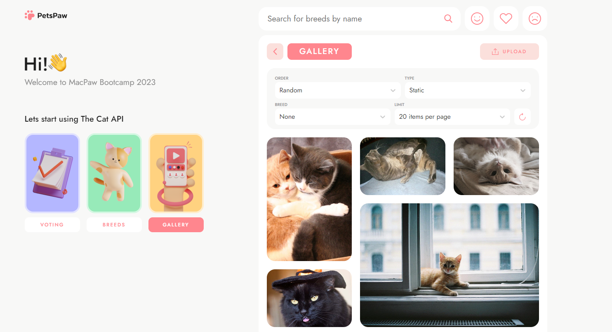

# Pets Paw

This is a "Pets Paw" test project for MACPAW. Written to demonstrate my abilities.

The site is an adaptive application for viewing, adding, voting and favouriting cat pictures. You have the opportunity to watch a random cat, search for them by breed, providing information about the breed itself. You can also save favorites, likes and dislikes cats.
***

## How to use

### Use on-line
 Нou can use this link: **[https://sl7one.github.io/PetsPaw/](https://sl7one.github.io/PetsPaw/)**

#### If site opening correctly, you will see the following pages:

***

## Technologies

The project is built on Next.JS using SCSS for styling.
axios - for Requests, swiper - for sviper Imgs.

